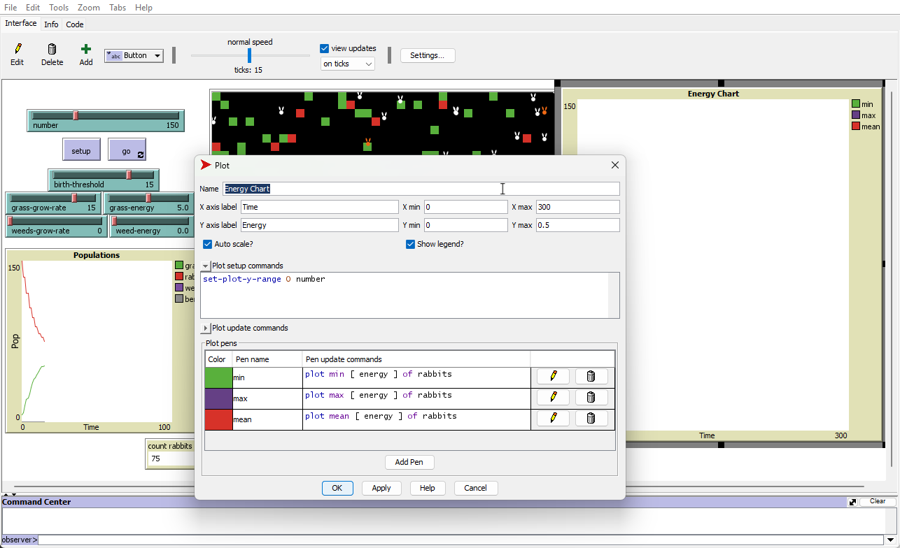
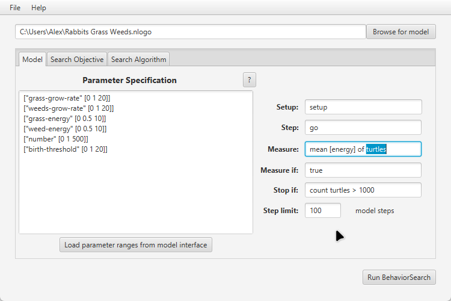
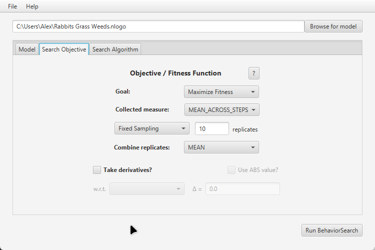
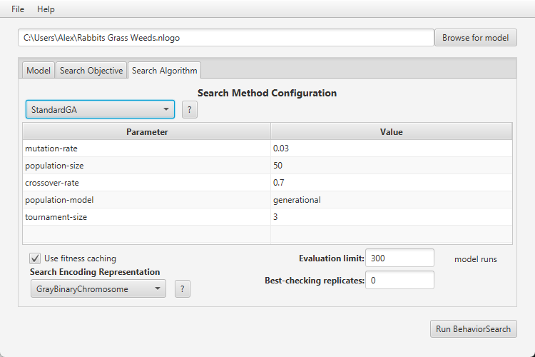
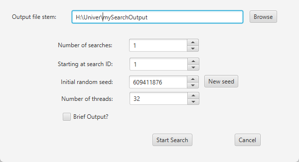
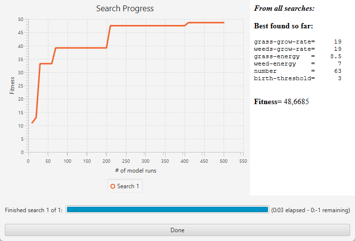
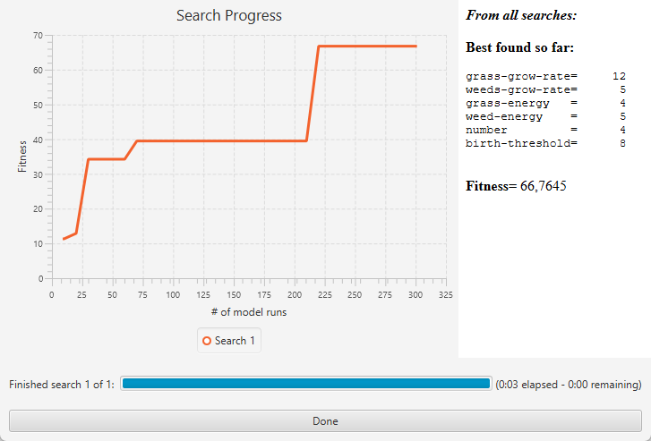

## Комп'ютерні системи імітаційного моделювання
## СПм-22-4, **Скиба Олександр Володимирович**
### Лабораторна робота №**3**. Використання засобів обчислювального интелекту для оптимізації імітаційних моделей

 

### Варіант 6, модель у середовищі NetLogo:
[Rabbits Grass Weeds](http://www.netlogoweb.org/launch#http://www.netlogoweb.org/assets/modelslib/Sample%20Models/Biology/Rabbits%20Grass%20Weeds.nlogo)

 

#### Вербальний опис моделі:
Ускладнена версія моделі [Rabbits Grass Weeds](http://www.netlogoweb.org/launch#http://www.netlogoweb.org/assets/modelslib/Sample%20Models/Biology/Rabbits%20Grass%20Weeds.nlogo). 
Симуляція життя кроликів в природному середовищі, де кожен кролик слідує простому набору правил: їсть траву 
або бур’яни чи ягоди, якщо вони доступні (*наближається до них і починає їсти*), або рухається, якщо їжі немає поблизу.
Також є можливість отруїтися при поїданні їжi, що вказано у внутрішніх параметрах як певна ймовірність.
Захворілий кролик не може харчуватися, переміщатися і розмножуватися, позначається іншим кольором і залишається 
хворим на 3 такти модельного часу. Кролики поділені на самців та самок. Поява нових кроликів вимагає
ситості, здоров’я, та присутності в одній із сусідніх клітин іншого ситого здорового кролика протилежної 
статі. Поява потомства відбувається з ймовірністю 50%. Модель показує, як можуть виникати зміни в популяції кроликів.

#### Керуючі параметри:
- **number** визначає початкову кількість зайців у середовищі моделювання.
- **birth-threshold** визначає кількість енергії, яку має накопичити заяць перед тим, як він може розмножитися.
- **grass-grow-rate** визначає темп росту трави в віртуальному середовищі, впливаючи на доступність їжі для зайців.
- **grass-energy** вказує, скільки енергії може надати спожита трава зайцям, коли вони її їдять.
- **weeds-grow-rate** визначає темп росту сорняків, які конкурують з травою за ресурси та можуть обмежувати її ріст.
- **weed-energy** вказує, скільки енергії може отримати заяць, споживаючи сорняки.

### Показники роботи системи:
- кількість зайців на поточному такті симуляції.
- кількість трави на поточному такті симуляції.
- кількість сорняків на поточному такті симуляції.

 

### Налаштування середовища BehaviorSearch:

**Обрана модель**:
<pre>
C:\Program Files\NetLogo 6.3.0\models\Sample Models\Biology\Rabbits Grass Weeds.nlogo
</pre>
**Параметри моделі** (вкладка Model):  
<pre>
["grass-grow-rate" [0 1 20]]
["weeds-grow-rate" [0 1 20]]
["grass-energy" [0 0.5 10]]
["weed-energy" [0 0.5 10]]
["number" [0 1 500]]
["birth-threshold" [0 1 20]]
</pre>
Використовувана міра:
Для фітнес-функції (вона ж функція пристосованості або цільова функція) було обрано значення середньої
кiлькостi енергiї всіх кроликiв в середовищi, вираз для її розрахунку взято з налаштувань графіка 
аналізованої імітаційної моделі в середовищі NetLogo

  
та вказано у параметрі "**Measure**":
<pre>
mean [energy] of turtles
</pre>
Середня кiлькiсть енергiї всіх всiх кроликiв повинна враховуватися **в середньому** за весь період симуляції тривалістю,
*для приклада*, 100 тактів (адже на кожному такті є своє значення поточної середньої кiлькiстi енергiї усіх кроликiв),
починаючи з 0 такту симуляції.  
Параметр зупинки за умовою ("**Stop if**").  
<pre>
count turtles > 1000
</pre>

Загальний вигляд вкладки налаштувань параметрів моделі:  

**Налаштування цільової функції** (вкладка Search Objective):

Метою підбору параметрів імітаційної моделі, що описує енергію кроликів, є  **максимізація** значення
середньої енергії кроликів на полі – це вказується через параметр **“Goal”** зі значенням **"Maximize Fitness"**. 
Тобто необхідно визначити такі параметри налаштувань моделі, у яких кролики мають найбільшу енергію і 
можуть жити найдовше.

При цьому цікавить не просто середня енергія кроликів у якийсь окремий момент симуляції, 
а середнє її значення за всю симуляцію (тривалість якої вказується на попередній вкладці).
Для цього у параметрі “Collected measure”, що визначає спосіб обліку значень обраного показника,
вказується MEAN_ACROSS_STEPS.

Щоб уникнути викривлення результатів через випадкові значення, що використовуються в 
логіці самої імітаційної моделі, кожна симуляція повторюється по 10 разів, результуюче 
значення розраховується як середнє арифметичне.

Загальний вигляд вкладки налаштувань цільової функції:  

**Налаштування алгоритму пошуку** (вкладка Search Algorithm):  
Загальний вид вкладки налаштувань алгоритму пошуку:  

 

### Результати використання BehaviorSearch:

Результат пошуку параметрів імітаційної моделі, використовуючи **генетичний алгоритм**:  

Результат пошуку параметрів імітаційної моделі, використовуючи **випадковий пошук**:  
